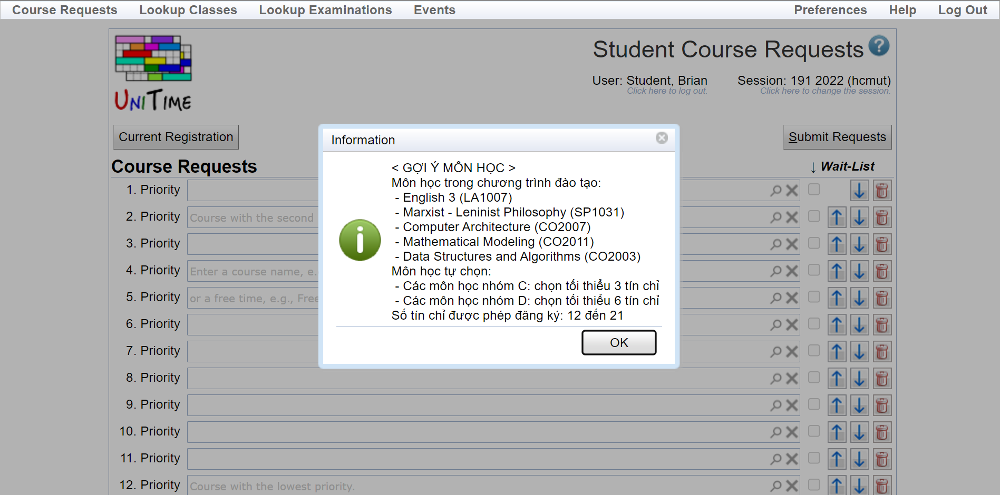
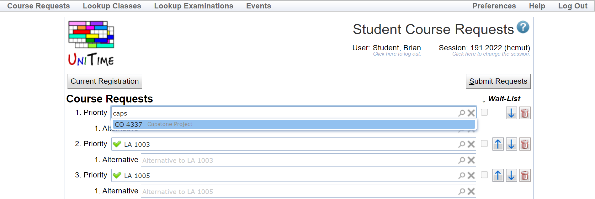

# User flow

// Hệ thống gợi ý môn học khi sinh viên truy cập trang đăng ký

// Sinh viên tìm kiếm và đăng ký Capstone Project

// Hệ thống báo lỗi không thể đăng ký 

// Sinh viên nhấn xem chi tiết lỗi. Trong ví dụ trên, sinh viên cần tích luỹ hai môn tiên quyết (Internship và Specialized Project) trước khi đăng ký Capstone Project.

// Sinh viên đăng ký Specialized Project (CO4029) và bị báo lỗi thiếu môn song hành.

// Sinh viên bổ sung môn song hành (CO3335) và quá trình đăng ký thành công. Sinh viên có thể quay lại để chỉnh sửa trong thời hạn đăng ký.

# UniTime - Hướng dẫn cài đặt và sử dụng module Đăng ký môn học

## Cài đặt UniTime
1. Tải và cài đặt bản build vào Tomcat
   
   Xem chi tiết tại <https://help.unitime.org/installation>

2. Tạo database UniTime
    - Sử dụng command line `mysql -uroot -p`
    - Import schema: `source ./mysql/schema.sql`
    - Import sample data: `source ./mysql/woebegon-data.sql`

1. Cấu hình server Tomcat
    - Tạo file cấu hình [unitime.properties](./unitime.properties). File này chứa cấu hình kết nối database và một số tham số khác để customize - tuỳ chỉnh UniTime.
    - Thêm đường dẫn đến file vừa tạo vào Java Option

      

      Ví dụ: `-Dtmtbl.custom.properties=D:\Phuc\College\UniTime\Tomcat 9.0\unitime.properties`

## Nhập liệu vào UniTime
1. Đăng nhập tài khoản admin (user:admin, password:admin)
2. Vào trang Data Exchange (Administration > Academic Session > Data Exchange)
    
    
    
    
3. Tải lên và import các file dữ liệu XML
    - Thêm học kì mới: import file [sessionSetup.xml](./xml/blank1_sessionSetup.xml)
    - Thêm dữ liệu môn học: import file [courseOffering.xml](./xml/blank2_courseOfferingImport.xml)
    - Thêm dữ liệu sinh viên: import file [studentInfo.xml](./xml/blank3_studentInfoImport.xml)
    - Đăng nhập lại vào tài khoản admin và vào trang Academic Sessions để kiểm tra học kì vừa được tạo (222 hcmut)
        
        

## Kiểm tra tính năng đăng ký môn học
1. Đăng nhập tài khoản sinh viên (user:student, password:student) và chọn kì đăng ký - hcmut 222
2. Vào trang Course Request
   
   
3. Tìm kiếm môn học
   
   Khi nhập vào ô tìm kiếm, trang đăng ký sẽ hiện danh sách các môn học có trong hệ thống.
3. Chọn danh sách môn học và nhấn đăng ký
    
    UniTime ghi nhận và thông báo đăng ký thành công

## FAQs
1. __Không tìm thấy trang Course Request?__
   Trong trường hợp Course Request không được hiển thị trên thanh menu, nguyên nhân có thể do sinh viên chưa được cấp quyền. Để cấp quyền cho sinh viên, admin xem trạng thái của kì đăng ký (status type) và vào trang Edit Status Type tương ứng
    
    Như hình trên, kì đăng ký đang ở trạng thái input_data_entry, do đó cần cập nhật input_data_entry để cho phép sinh viên đăng ký.
    

2. __Tạo tài khoản cho sinh viên?__
   UniTime cho phép tạo và xác thực tài khoản thông qua username và password. Để tạo tài khoản cho sinh viên, admin cần thêm tài khoản mới và liên kết nó với dữ liệu sinh viên hiện có.
    
    
    Trong hình trên, trường `External Id` tương ứng với externalId mà sinh viên đã được gán trong file [studentInfo.xml](./xml/blank3_studentInfoImport.xml)
