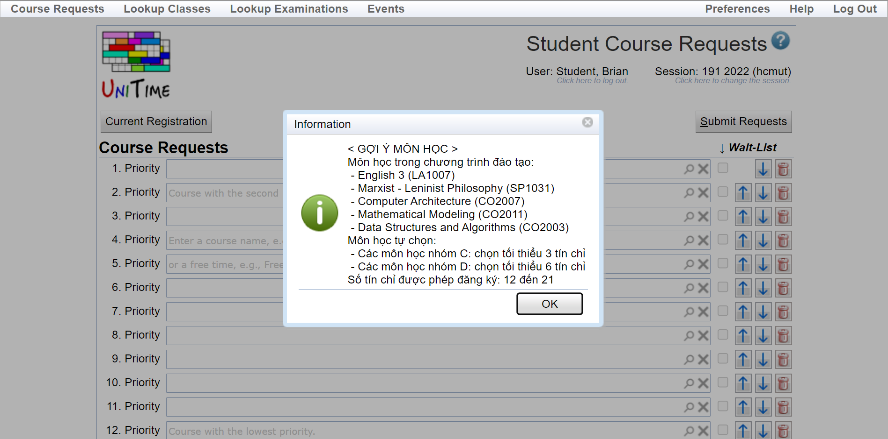
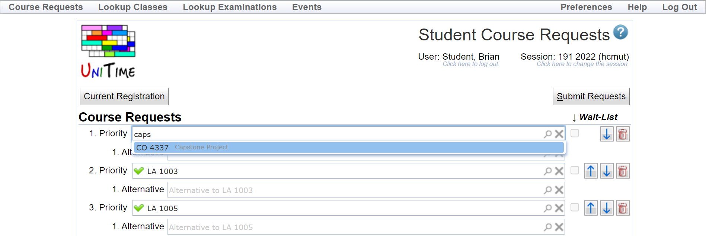
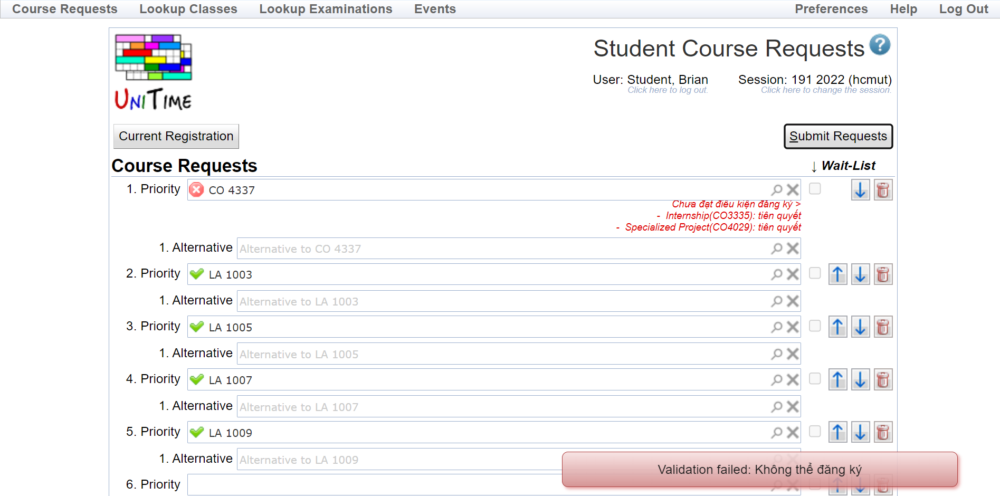
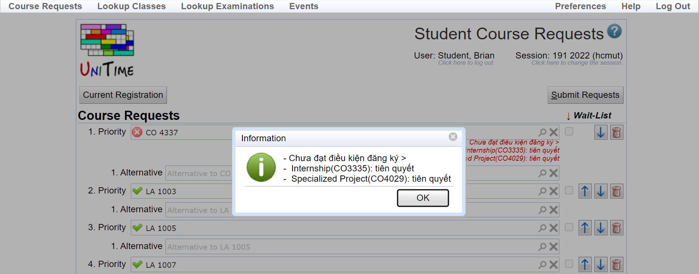
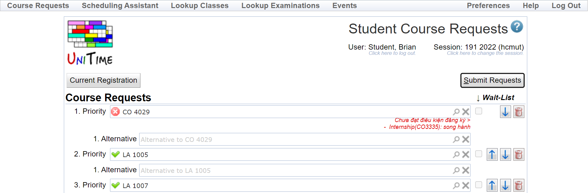
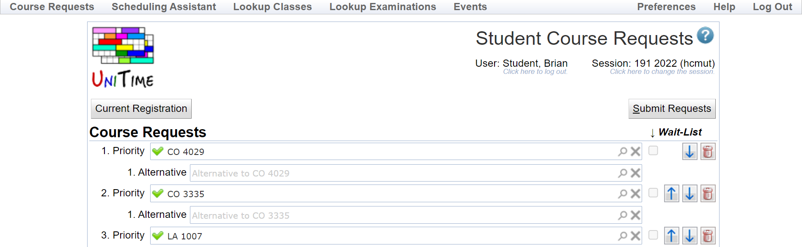

# User flow

// Hệ thống gợi ý môn học khi sinh viên truy cập trang đăng ký

// Sinh viên tìm kiếm và đăng ký Capstone Project

// Hệ thống báo lỗi không thể đăng ký 

// Sinh viên nhấn xem chi tiết lỗi. Trong ví dụ trên, sinh viên cần tích luỹ hai môn tiên quyết (Internship và Specialized Project) trước khi đăng ký Capstone Project.

// Sinh viên đăng ký Specialized Project (CO4029) và bị báo lỗi thiếu môn song hành.

// Sinh viên bổ sung môn song hành (CO3335) và quá trình đăng ký thành công. Sinh viên có thể quay lại để chỉnh sửa trong thời hạn đăng ký.
